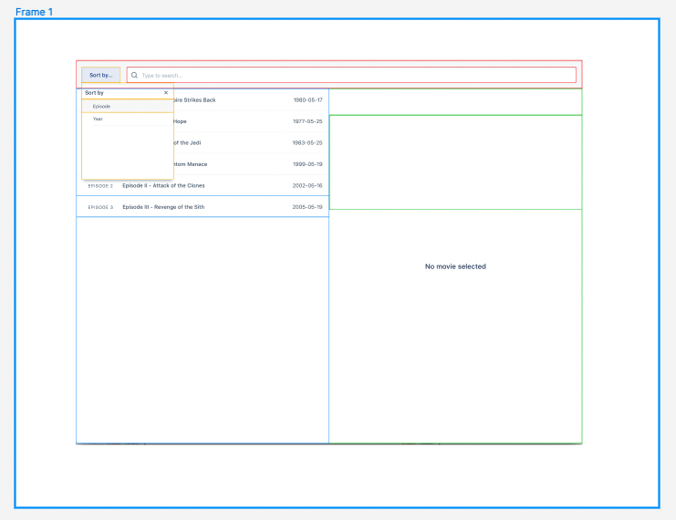

# Front-end assignment at Etraveli Group
## Overview
This is my solution to the front-end assignment for Etraveli Group. The original specs can be read [here](SPECS.md).

## Process

### Bootstrapping
I bootsraped this project using [Create React App](https://github.com/facebook/create-react-app) which I find to be usefull for quickly spinning up front-end projects when prototyping, but also for longer term projects as it has great developer support and is quite configurable through add-ons like [CRACO](https://github.com/gsoft-inc/craco) (I have not needed to eject in a long time). For more details on Create React App, see the [Development](#development) section below.

### UI Components
Before writing any code, I blocked out some of the possible components in a [Figma wireframe](https://www.figma.com/file/Xuq1XB1D457fzvH8HTleBU/Wireframe?node-id=0%3A1). 

This helped identify 4 main UI features:
1. Search
2. Sorting
3. Episodes Display
5. Detail Display

In addittion there would need to be:

6. Data Fetching
7. Loading State
8. Error Handling

### User Stories
Based on the [specs document](SPECS.md):
1. As a user, I would like to see a list of all Star Wars films so that I can select one and read details about the film.
2. As a user, I would like to be able to filter the list based on year or episode.
3. As a user, I would like to be able to filter the list based on search criteria.

----------

## Development

This project was bootstrapped with [Create React App](https://github.com/facebook/create-react-app).

### Available Scripts

In the project directory, you can run:

#### `yarn start`

Runs the app in the development mode.\
Open [http://localhost:3000](http://localhost:3000) to view it in the browser.

The page will reload if you make edits.\
You will also see any lint errors in the console.

#### `yarn test`

Launches the test runner in the interactive watch mode.\
See the section about [running tests](https://facebook.github.io/create-react-app/docs/running-tests) for more information.

#### `yarn build`

Builds the app for production to the `build` folder.\
It correctly bundles React in production mode and optimizes the build for the best performance.

The build is minified and the filenames include the hashes.\
Your app is ready to be deployed!

See the section about [deployment](https://facebook.github.io/create-react-app/docs/deployment) for more information.

#### `yarn eject`

**Note: this is a one-way operation. Once you `eject`, you can’t go back!**

If you aren’t satisfied with the build tool and configuration choices, you can `eject` at any time. This command will remove the single build dependency from your project.

Instead, it will copy all the configuration files and the transitive dependencies (webpack, Babel, ESLint, etc) right into your project so you have full control over them. All of the commands except `eject` will still work, but they will point to the copied scripts so you can tweak them. At this point you’re on your own.

You don’t have to ever use `eject`. The curated feature set is suitable for small and middle deployments, and you shouldn’t feel obligated to use this feature. However we understand that this tool wouldn’t be useful if you couldn’t customize it when you are ready for it.

### Learn More

You can learn more in the [Create React App documentation](https://facebook.github.io/create-react-app/docs/getting-started).

To learn React, check out the [React documentation](https://reactjs.org/).
